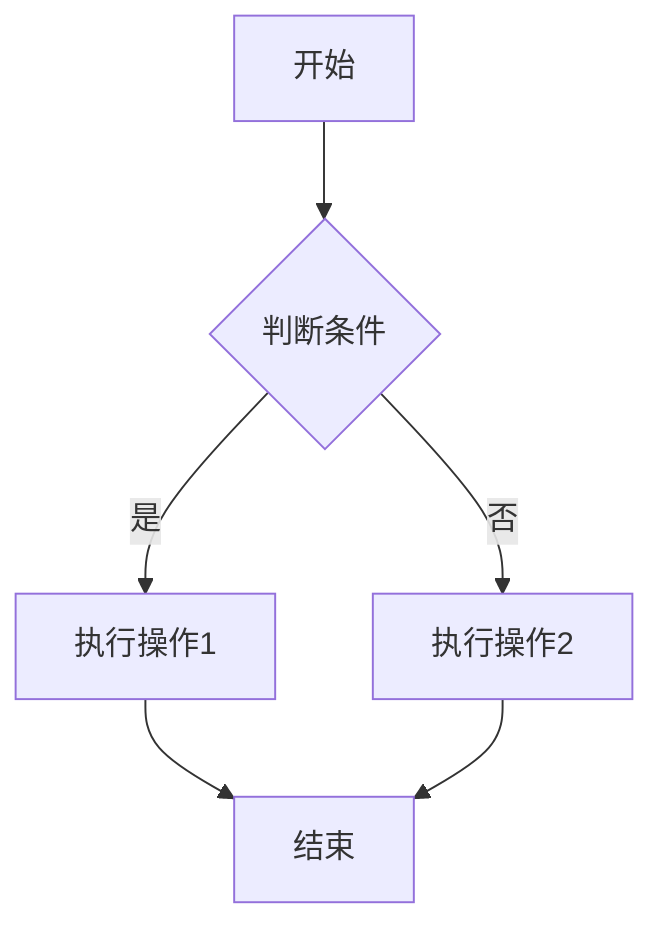

# v3-markdown-stream

[](https://npmjs.org/package/v3-markdown-stream) [](https://npmjs.org/package/v3-markdown-stream)

一个基于 Vue 3 的高性能 Markdown 流式渲染组件，支持增量输出、无闪屏、无卡顿，样式友好。

[演示地址](https://xhy12345.github.io/ "演示地址")

> **🔧 环境要求：**
> - `@vitejs/plugin-vue` 版本必须 **≥ 6.0.1** 
> - `vite` 版本必须 **≥ 7.2.2**
> 
> 请确保你的项目依赖满足以上版本要求，否则可能会出现兼容性问题！

## 特性

- ✨ **流式输出**：支持增量渲染 Markdown 内容，适用于大文本或流式数据场景
- 🎯 **无闪屏渲染**：每次更新内容时保持平滑过渡，提升用户体验(不完整图片链接、表格、数学公式缓存处理)
- 🎨 **样式友好**：内置美观的默认样式，支持自定义主题颜色
- 🚀 **高性能**：使用 Vue 的 computed 缓存和响应式系统优化渲染性能
- 📋 **全面的 Markdown 支持**：代码高亮、GFM、原生Html标签、表格支持导出、代码支持可复制
- 🧩 **插件系统**：支持自定义组件渲染插件，可在 Markdown 中嵌入 ECharts 图表等自定义 Vue 组件
- 📊 **Mermaid & ECharts**：支持 ` ```mermaid ` 和 ` ```echarts ` 代码块语法渲染图表，自带 Preview/Source 切换、复制、下载、缩放、全屏等功能
- 📄 **报告文档链接**：自动识别 Markdown 链接中包含 `type=result` 参数的 URL，渲染为带下载按钮的文档卡片
- ⏳ **碎片 Loading**：流式输出中不完整的图片、数学公式、插件语法、Mermaid/ECharts 代码块自动展示 loading 动画

## 安装

### NPM / Yarn

```bash
npm install v3-markdown-stream
# 或
yarn add v3-markdown-stream
```

## 基本用法

### 在 Vue 组件中使用

```vue
<template>
  <div>
    <MarkdownRender :markInfo="markdownContent" />
  </div>
</template>

<script setup>
import { ref } from 'vue'
import { MarkdownRender } from 'v3-markdown-stream';
import 'v3-markdown-stream/dist/v3-markdown-stream.css';

// 静态内容
const markdownContent = ref('# Hello World\n\nThis is a simple markdown example.')
</script>
```

## 参数说明

|参数名|必填|类型|默认值|描述|
|-|-|-|-|-|
|markInfo|是|String|''|Markdown 文本内容，可以一次性传入完整内容，也可以通过流式方式逐步添加内容|
|themeColor|否|String|'#000000'|主题色（Strong标签字体颜色）|
|baseFontSize|否|String|'1em'|基础字体大小|
|pluginRegistry|否|Object|null|插件注册表，通过 `createPluginRegistry` 创建，用于支持自定义组件渲染|

## 事件

|事件名|参数|描述|
|-|-|-|
|refClick|numbers: number[]|当 `<ref>` 标签被点击时触发，参数为从 `[3]` 或 `[1,2,3]` 中提取的数字数组|

### 用法示例

```vue
<template>
  <MarkdownRender :markInfo="content" @refClick="onRefClick" />
</template>

<script setup>
const onRefClick = (numbers) => {
  console.log('点击了引用:', numbers) // 例如 [3] 或 [1, 2, 3]
}
</script>
```

Markdown 中使用：

```markdown
这是引用文献<ref>[3]</ref>
这是多个引用<ref>[1,2,3]</ref>
```

## 插件系统

插件系统允许你在 Markdown 中嵌入自定义 Vue 组件。**ECharts 和 Mermaid 插件已内置**，无需手动引入即可直接使用。

### 基本用法

内置插件支持两种语法：

#### 1. 代码块语法（推荐）

使用 ` ```mermaid ` 和 ` ```echarts ` 代码块，自带 Preview/Source 切换、复制、下载、缩放、全屏等功能卡片：

````markdown


```echarts
{
  "title": { "text": "月度销售额" },
  "tooltip": { "trigger": "axis" },
  "xAxis": { "type": "category", "data": ["一月", "二月", "三月"] },
  "yAxis": { "type": "value" },
  "series": [{ "type": "bar", "data": [10, 20, 30] }]
}
```
````

- **ECharts**：代码块内容为完整的 ECharts `option` 对象（JSON 格式）
- **Mermaid**：代码块内容为 Mermaid 语法文本
- 流式输出时，Mermaid 代码块未闭合前显示 loading，闭合后自动渲染；ECharts 在 JSON 合法后渲染，非法时显示 loading

#### 2. 插件语法（兼容）

使用 `[[plugin JSON配置]]` 语法，直接渲染图表（无卡片包装）：

```markdown
[[echarts {"type":"bar","data":[10,20,30,40,50]}]]

[[mermaid {"code":"graph TD\\n    A --> B"}]]
```

### ECharts 插件

ECharts 支持两种使用方式：

- **代码块语法**（推荐）：` ```echarts ` 代码块内容为完整的 ECharts `option` 对象（JSON），支持所有 ECharts 配置
- **插件语法**：`[[echarts JSON配置]]`，支持简单模式和完整模式

|配置项|类型|默认值|描述|
|-|-|-|-|
|type|String|-|图表类型：bar、line、pie 等（简单模式，仅插件语法）|
|data|Array|-|图表数据（简单模式，仅插件语法）|
|width|String|'100%'|图表容器宽度（仅插件语法）|
|height|String|'300px'|图表容器高度（仅插件语法）|
|series|Array|-|ECharts series 配置（完整模式，与 type 互斥）|
|其他|Any|-|所有 ECharts option 配置项均可传入|

- **简单模式**（插件语法）：传入 `type` + `data`，自动补全坐标轴等配置
- **完整模式**：直接传入 ECharts 的 `option` 配置，支持所有 ECharts 功能

### Mermaid 插件

Mermaid 支持两种使用方式：

- **代码块语法**（推荐）：` ```mermaid ` 代码块内容为 Mermaid 语法文本，支持流程图、时序图、甘特图等
- **插件语法**：`[[mermaid {"code":"..."}]]`，通过 `code` 字段传入 Mermaid 代码

流式输出时，Mermaid 代码块未闭合前显示 loading，闭合后自动渲染，避免语法不合法时报错。

### 报告文档链接

当 Markdown 中出现链接 URL 包含 `type=result` 参数时，自动渲染为文档卡片（含文档图标 + 标题 + 下载按钮），无需额外配置：

```markdown
[AI客服平台 — 需求文档](https://example.com/report/requirement.pdf?type=result)

[2026年度技术报告](https://example.com/report/tech-2026.docx?type=result&format=docx)
```

- 自动识别标准 Markdown 链接 `[文本](url)` 中 URL 是否包含 `type=result` 参数
- 渲染为圆角卡片，左侧显示文档图标和标题，右侧显示下载按钮
- 点击下载按钮触发文件下载，点击卡片区域在新窗口打开链接

### 自定义插件

你可以创建自己的插件，只需定义一个符合接口的对象：

```js
import { createPluginPattern } from 'v3-markdown-stream'

const myPlugin = {
  name: 'mywidget',                          // 插件名（用于 [[mywidget ...]] 语法）
  tagName: 'v3md-mywidget',                  // 自定义 HTML 标签名
  pattern: createPluginPattern('mywidget'),  // 匹配正则（或自定义 RegExp）
  component: MyWidgetVueComponent,           // Vue 组件，接收 config prop
}

const registry = createPluginRegistry([myPlugin])
```

插件组件会通过 `config` prop 接收解析后的 JSON 配置对象：

```vue
<script setup>
const props = defineProps({
  config: {
    type: Object,
    default: () => ({})
  }
})
</script>
```

### API

#### `createPluginRegistry(plugins)`

创建插件注册表。

- **参数**：`plugins: Array<Plugin>` — 插件数组
- **返回**：插件注册表对象，传入 `MarkdownRender` 的 `pluginRegistry` prop

#### `createPluginPattern(name)`

根据插件名生成匹配 `[[name ...]]` 语法的正则表达式。

- **参数**：`name: String` — 插件名
- **返回**：`RegExp` — 全局正则表达式


[GitHub源码仓库地址](https://github.com/xhy12345/v3-markdown-stream)


如果觉得好用，欢迎给个Star ⭐️ 支持一下！

## 贡献

欢迎提交 Issues 和 Pull Requests 来帮助改进这个组件！

## 许可证

MIT